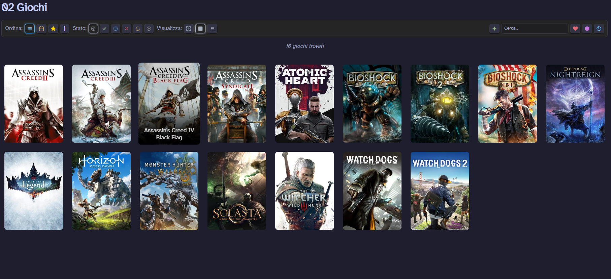
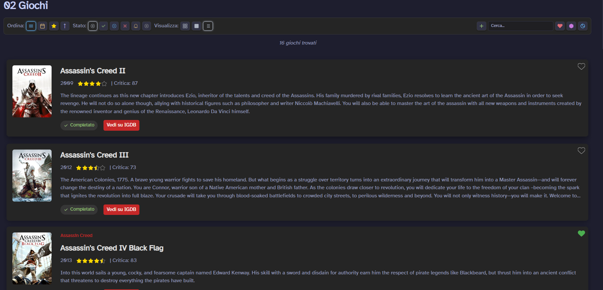
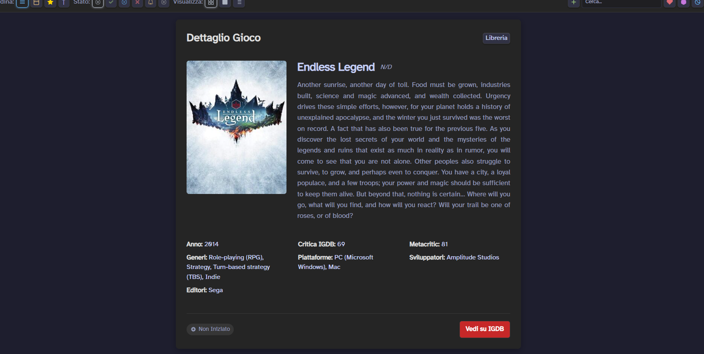
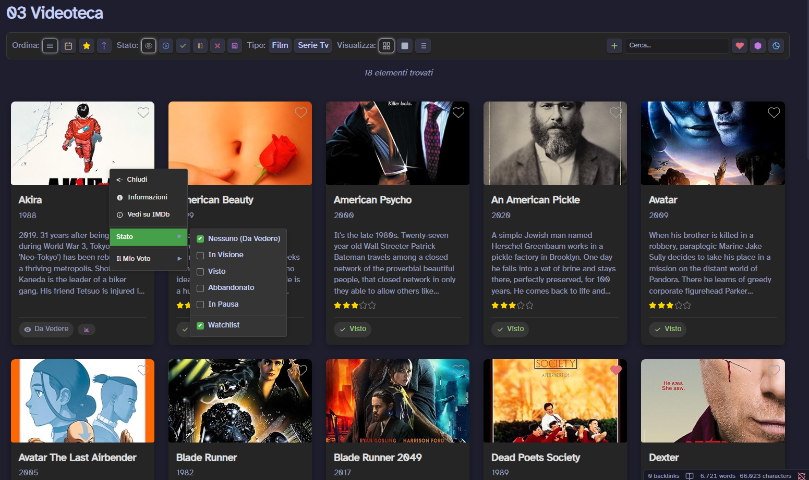
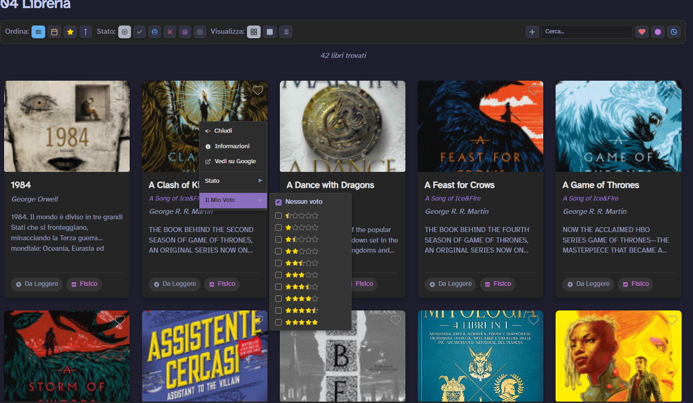
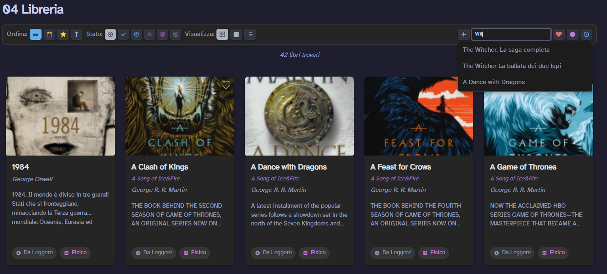
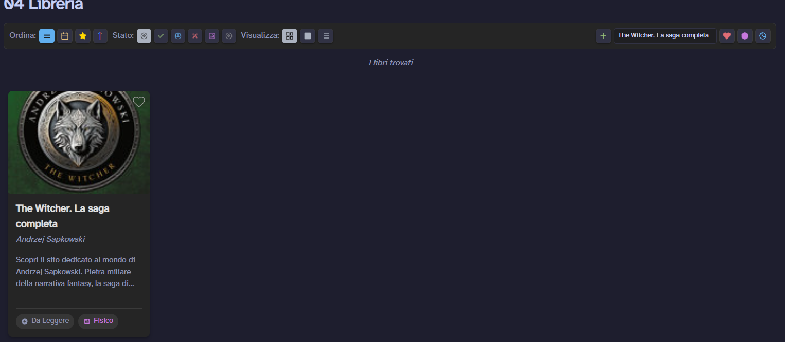
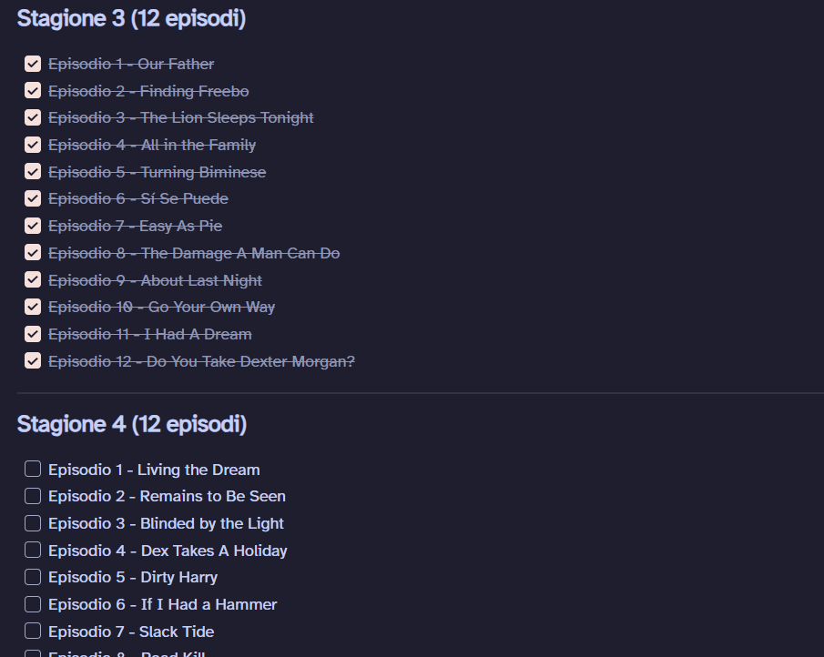

# Obsidian_InteractableUI
An interactable UI for Obsidian using DataviewJS. This was made using AI for coding

# Images

I can change the view with the menu on top

2nd Alternative

If i want to see a random book/game/film that i haven't finished i can click that button and it shows one random item

If i want to do a change or see some other info of the file i can

If i right click on the card it opens a menu where i can have a few options and i can quickly change the status and the ratings of that obsidian property and it shows quickly

There is a search function with auto completition and other filters in the bar

# About

This is an interactable UI made in js with the support of dataview (a plugin you can find in the community plugins)

How it works? I don't know. I was surfing on reddit on obsidian and found someone who posted a similar ui but with barebone functions. I took it and with the help of an ai i managed to create this interactable UI for storing info about your favoruite things. I used three different versions for all.
In my mind i wanted to do an automated system.
1. I use templater for a template witch you fill find in the github folders
2. I use Quickadd to run some js script so that i can search the name of a file and get all the metadata
   2.1 I use different sites for the meta data, Google Books, OMDB for media and IGDB for games. For all these three (google book optional) you will need an apikey
   2.2 You also need to setup quick add. Example: I have a setting called add Media which uses the macro LookupMovie, inside the macro i have the script with the apikey and the template
   3.3 If you need to connect the ui to setting you need to find the option on the dataviewjs so that when you press + it automatically ask for your input without you need to press ctrl p
4. After the metadata is gathered it creates a note with all the info
5. Finally it shows on the dataviewjs where i can manage all

Cool thing about the tv series search is that it now automatically generate the list of episodes and a checkbox so you can keep track
   

