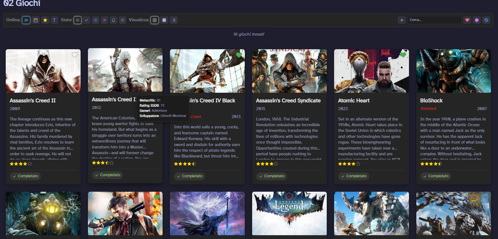

# Obsidian_InteractableUI
An interactable UI for Obsidian using DataviewJS. This was made using AI for coding

# Images

## About
If i right click on the card it opens a menu where i can have a few options and i can quickly change the status and the ratings of that obsidian property and it shows quickly

